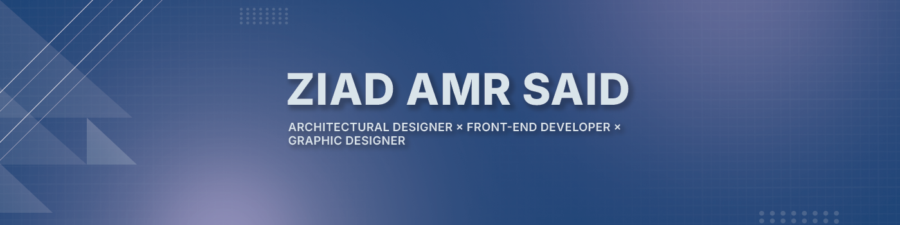

<h1 align="center">Hi, I'm Ziad Amr 👋</h1>

  Frontend Developer • UI-focused • Architecture-driven thinking

  
  
  

---

## Table of Contents
- [About Me](#about-me)
- [Highlights](#highlights)
- [Tech Stack](#tech-stack)
- [Selected Projects](#selected-projects)
- [How I Work](#how-i-work)
- [Get in Touch](#get-in-touch)
- [Quote](#quote)

---

## About Me
I'm a frontend developer who cares deeply about UI clarity, layout logic, and pixel-level consistency.  
I build reusable component systems and responsive interfaces with an emphasis on spacing, alignment, and pragmatic design.  
My background in backend and automation (Node.js, Python) informs how I structure data flow and integrate APIs.

---

## Highlights
- UI-first mindset with focus on composition, spacing, and readability  
- Component-driven architecture with reusability in mind  
- Strong sense for responsive layouts and cross-browser polish  
- Comfortable bridging frontend and backend concerns  
- Interest in applying software practices to BIM workflows and automation  

---

## Tech Stack

  

- **Frontend:** HTML5, CSS3, JavaScript (ES6+), React  
- **Styling:** Tailwind CSS, Bootstrap, PostCSS  
- **Backend (familiar):** Node.js  
- **Scripting & Automation:** Python  
- **Tooling:** Vite, Git, GitHub, VS Code  

---

## Selected Projects

### BIM AI Agent (Revit + MCP)
Experimental integration of BIM (Revit) with AI-driven workflows using Model Context Protocol (MCP).  
Focuses on automating model data extraction and enabling engineering-oriented tools.  
[View Repository](https://github.com/Ziad-Amr1/bim-ai-agent)

### LumoHub
Component-first frontend project emphasizing clean layout systems and reusable UI primitives.  
Demonstrates structure, consistency, and design patterns.  
[View Repository](https://github.com/Ziad-Amr1/LumoHub)

### Level Up Website
Responsive website built to practice layout composition, semantic structure, and modern UI patterns.  
Explores component separation and accessibility basics.  
[View Repository](https://github.com/Ziad-Amr1/Level-Up-Website)

### Gaming Website
Frontend-focused project highlighting interactive UI elements, animations, and responsive layouts.  
[View Repository](https://github.com/Ziad-Amr1/Gaming-Website)

---

## How I Work
- I iterate visually: prototypes → components → responsive refinement  
- I prioritize accessible, semantic HTML and utility-first styling  
- I prefer small, focused components with clear props and minimal side effects  
- I use automation and scripts for repetitive tasks and build optimizations  

---

## Get in Touch
- **Portfolio:** https://ziad-amr-portfolio.netlify.app/  
- **LinkedIn:** https://www.linkedin.com/in/ziadamrsaid  
- **GitHub:** https://github.com/Ziad-Amr1  

Open to collaborations, frontend roles, and projects at the intersection of UI and data-driven workflows.

---

## Quote
> *Good UI is rarely about complexity — it’s about clarity, spacing, and consistency.*
